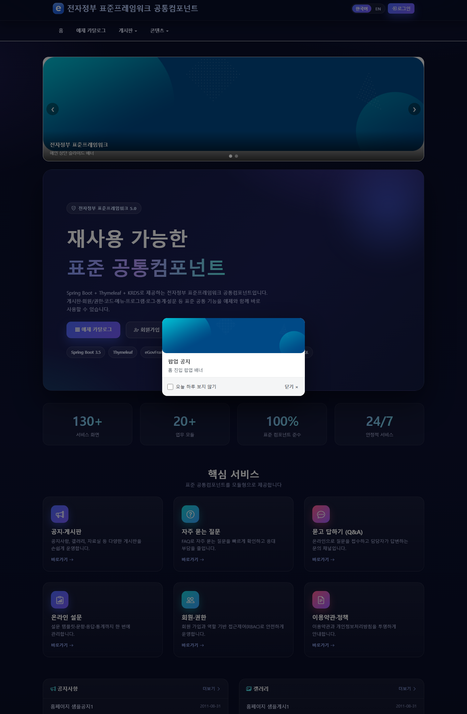
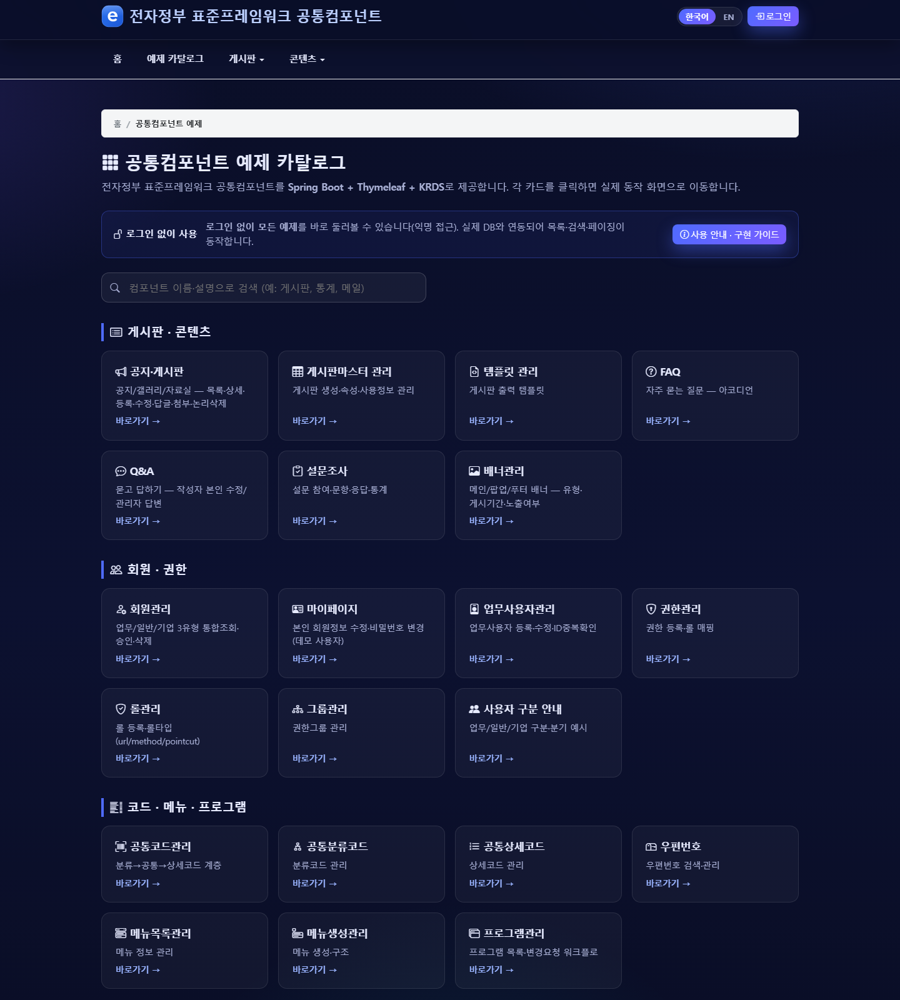
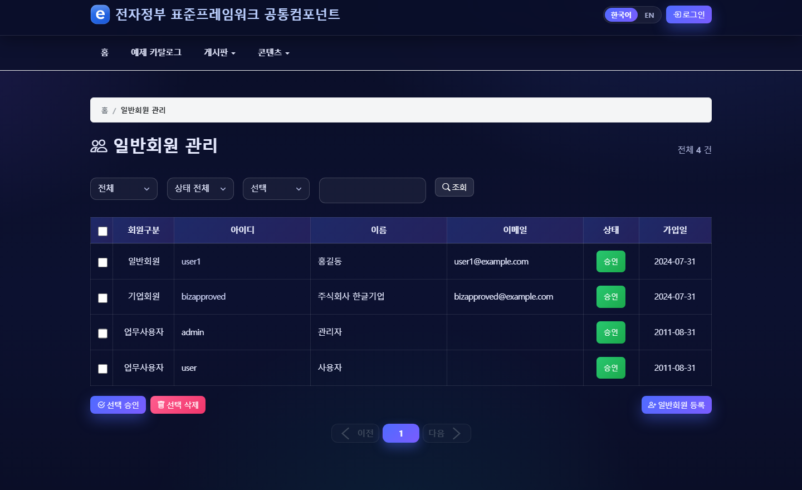
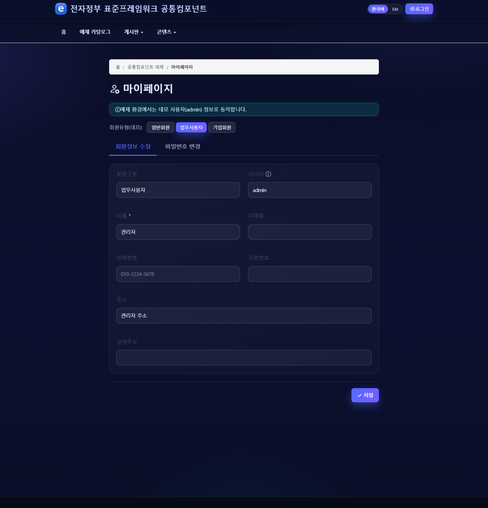
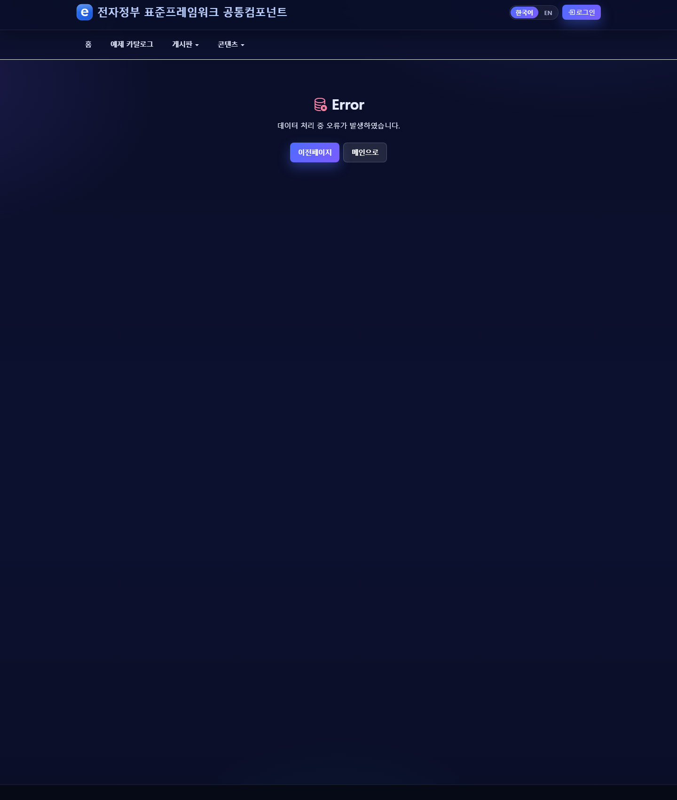
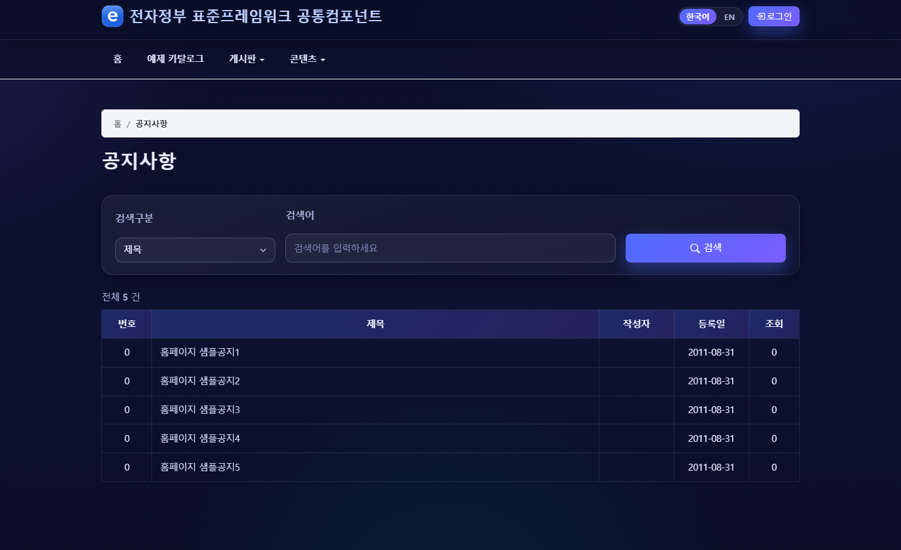
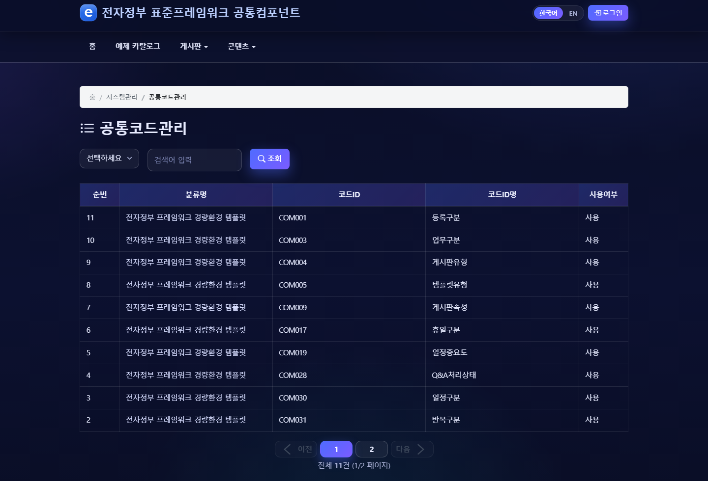

# 전자정부 표준프레임워크 공통컴포넌트 (Spring Boot + Thymeleaf + KRDS)


> 전자정부 표준프레임워크 **공통컴포넌트(JSP/WAR)** 를 **Spring Boot 3.5 + Thymeleaf(JAR)** 로 전환하고,
> **KRDS(Korea Design System)** 디자인과 **다국어(한국어/English)** 를 적용한 프로젝트입니다.
> 별도 DB 설치 없이 **예제와 함께 바로 실행**되며, 모든 예제는 **로그인 없이(익명 접근)** 실제 DB와 연동되어 동작합니다.

---

## 프로젝트 소개

### 개요

| 항목 | 내용 |
|------|------|
| 기반 | 전자정부 표준프레임워크 5.0 공통컴포넌트 |
| 전환 | JSP/WAR → **Spring Boot 3.5 + Thymeleaf(JAR)** |
| 디자인 | **KRDS**(공식 로컬 자원, CDN 미사용) · Pretendard GOV · Bootstrap 프레임워크 미사용(`bi-*` 아이콘만) |
| 다국어 | 한국어/English (`message-ui_{ko,en}.properties`) |
| DB | 내장 HSQL 런타임(무설정 실행) · 운영용 **6종 DBMS** DDL/DML 동봉 |
| 실행 | Java 17 · Maven 3.9.9 · 포트 **38080** |

### 기술 스택

- **Backend**: Java 17, Spring Boot 3.5, eGovFrame 5.0 RTE, MyBatis
- **View**: Thymeleaf + Thymeleaf Layout Dialect, KRDS
- **DB**: 내장 HSQLDB(개발/데모), 운영 DDL/DML — Altibase · CUBRID · MySQL · Oracle · PostgreSQL · Tibero
- **Security**: Spring Security(세션 로그인), 역할 기반 접근제어(RBAC)

---

## 빠른 시작 (Quickstart)

```bash
# JDK 17 + Maven 3.9.9 필요
mvn clean package -DskipTests
java -Dfile.encoding=UTF-8 -jar target/egovframe-boot-common-components-5.0.0.jar --server.port=38080

# 또는 개발 모드
mvn spring-boot:run
```

- 접속: **http://localhost:38080**
- 예제 카탈로그: **http://localhost:38080/examples**
- 로그인: **http://localhost:38080/uat/uia/egovLoginUsr.do**
- 모든 예제는 **로그인 없이도** 실제 DB와 연동되어 조회·검색·페이징이 동작합니다.

---

## 테스트 계정 · 로그인 · 권한

전자정부 표준프레임워크 공통컴포넌트 [일반로그인 가이드](https://www.egovframe.go.kr/wiki/doku.php?id=egovframework:com:v2:uat:일반로그인)의 **표준 샘플 계정**을 그대로 제공합니다. 비밀번호는 공통 `rhdxhd12`(=`공통12`를 영문 자판으로 입력) 이며 **대소문자를 구분**합니다.

| 사용자 구분 | ID | 비밀번호 | 권한 |
|------|-----|---------|------|
| 업무사용자(직원) | `TEST1` | `rhdxhd12` | 일반 사용자(ROLE_USER) |
| 업무사용자(직원) | `webmaster` | `rhdxhd12` | 일반 사용자(ROLE_USER) |
| 일반회원 | `USER` | `rhdxhd12` | 일반 사용자(ROLE_USER) |
| 기업회원 | `ENTERPRISE` | `rhdxhd12` | 일반 사용자(ROLE_USER) |
| 관리자 | `admin` | `1` | 관리자(ROLE_ADMIN) |

- **로그인 화면**에서 사용자 구분(업무사용자/일반회원/기업회원)을 선택한 뒤 ID·비밀번호를 입력합니다. 구분별로 대상 테이블(`TB_EMPLYR_INFO`/`TB_GNRL_MBER`/`TB_ENTRPRS_MBER`)이 분기됩니다.
- **권한 기반 접근제어(RBAC)**: `admin` 계정만 **관리자(ROLE_ADMIN)** 로, 관리자 전용 메뉴(회원·권한 / 코드·메뉴 / 시스템관리)가 노출됩니다. 표준 샘플 계정(TEST1/webmaster/USER/ENTERPRISE)은 **일반 사용자(ROLE_USER)** 입니다.
- **헤더 사용자 구분 표시**: 로그인하면 헤더에 사용자 구분(업무사용자/일반회원/기업회원) 배지가 표시됩니다.
- **본인 정보수정(마이페이지)**: 로그인한 모든 사용자는 헤더의 **"내 정보수정"** 에서 본인 정보를 조회·수정할 수 있습니다.
- 비밀번호 해시는 `EgovFileScrty.encryptPassword(pw, id)` = `Base64(SHA-256(id ‖ pw))` 방식이며, 공식 배포 DML(`script/dml/**/com_DML_*.sql`)의 값과 동일합니다.

---

## 화면 구성

### 메인 홈 (KRDS · 다국어)

전자정부 표준프레임워크 공통컴포넌트 소개, 핵심 서비스 카드, 슬라이드/팝업 배너, 최신 공지·갤러리를 제공합니다.



### 예제 카탈로그 (`/examples`)

게시판·회원·권한·코드·메뉴·프로그램·로그·통계 등 전 모듈을 카드로 모아, 클릭 한 번으로 실제 동작 화면으로 이동합니다.



### 회원관리 (3유형 통합)

일반회원·기업회원·업무사용자를 **한 화면에서 통합 조회**하고, 회원구분·상태검색·선택 승인/삭제·페이지네이션을 지원합니다.



### 마이페이지

로그인 본인의 회원정보 수정·비밀번호 변경. 회원 유형(일반/기업/업무사용자)에 따라 대상 테이블이 분기되며, 세션 본인 기준으로만 동작합니다(헤더 "내 정보수정" 진입).



### 회원가입

계정·기본·연락처/주소 정보 입력, 아이디 중복확인·우편번호 검색 팝업 연동.



### 게시판 (공지/갤러리/자료실)

목록·상세·등록·수정·답글·첨부·논리삭제. 게시판마스터로 게시판을 생성·설정합니다.



### 공통코드 관리

공통분류코드 → 공통코드 → 공통상세코드 **3계층 CRUD**, 분류·검색·사용여부·페이지네이션.



---

## 기능 모듈

### ✅ 코어 공통컴포넌트 — Boot + Thymeleaf + KRDS + i18n + `TB_` 표준화 완비

| 분류 | 모듈 |
|------|------|
| 게시판·콘텐츠 | 공지/갤러리/자료실(답글·첨부·논리삭제), 게시판마스터, 템플릿, FAQ, Q&A, 설문조사, 배너(메인/팝업/푸터·게시기간) |
| 회원·권한 | 회원관리(일반·기업·업무사용자 3유형 통합), 업무사용자, 권한, 롤, 그룹, 사용자구분 안내, 마이페이지 |
| 코드·메뉴·프로그램 | 공통코드(분류/공통/상세), 우편번호, 메뉴목록/생성, 프로그램(변경요청→처리→이력 워크플로) |
| 로그·통계·정책 | 접속로그, 시스템로그, 접속통계, 휴일/달력, 약관/개인정보처리방침(통합·푸터 모달), 로그인정책, 사용자부재 |
| 공통 | 로그인(세션), KRDS 컴포넌트 예시, 예제 카탈로그(`/examples`) |

### 🔶 확장/주변 모듈 (이식 진행 대상)

스마트에디터·댓글·커뮤니티·통지·SMS·이메일 · 디지털콘텐츠관리(dam) · 배치(bat)·SSO(ssi)·보안고급(drm/pki) · 시스템 모니터링(서버/네트워크/백업) 등 eGov 공통컴포넌트 풀셋.
원본(JSP/WAR)은 `_legacy_jsp_src/`에 보존되어 있으며, 모듈별로 **`TB_` 표준화 → 매퍼(7종) → Thymeleaf+KRDS 전환** 순으로 이식합니다.

---

## 다국어 (i18n)

- 메시지: `src/main/resources/messages/message-ui_{ko,en}.properties` (+ 기본 `message-ui.properties`)
- 템플릿: `th:text`/`th:utext` + `#{key}` 로 하드코딩 한글 제거
- 전환: 헤더의 **한국어 / EN** 토글 → `/cmm/lang` → `CookieLocaleResolver`(쿠키 `LANG`) → 이전 화면으로 복귀(PRG)

---

## 데이터베이스

- **명명 표준**: 테이블 `TB_` + snake_case, 감사 컬럼 4종(등록자/등록일시/수정자/수정일시)
- **런타임**: 내장 HSQLDB — 무설정 실행(`src/main/resources/db/shtdb.sql`)
- **운영 DDL/DML**: `DATABASE/<dbms>/` 아래 **6종 DBMS**(Altibase · CUBRID · MySQL · Oracle · PostgreSQL · Tibero)
  - DDL 전 컬럼에 **한글 논리명 인라인 주석** 부여 (예: `EMPLYR_ID VARCHAR(20) ... -- 사용자ID`)
  - DML INSERT는 컬럼명을 명시(6종 DBMS 전량)
  - DDL↔DML 정합(테이블 일치) 검증 완료
- **매퍼**: MyBatis 7종 DBMS(HSQL 기본 + 위 6종)

---

## 프로젝트 구조

```
common-components-boot/
├─ src/main/java/egovframework/com/     # 공통컴포넌트 소스(cmm·cop·uss·sym·utl ...)
├─ src/main/resources/
│  ├─ templates/                        # Thymeleaf 뷰(KRDS)
│  ├─ messages/                         # i18n(ko/en)
│  ├─ egovframework/mapper/             # MyBatis 매퍼(7종 DBMS)
│  ├─ static/krds/                      # KRDS 로컬 자원
│  └─ db/shtdb.sql                      # 내장 HSQL 스키마+시드
├─ DATABASE/<dbms>/                     # 운영용 6종 DBMS DDL/DML
├─ Docs/                                # 규칙·가이드·스크린샷 등 레퍼런스 문서
└─ _legacy_jsp_src/                     # 원본 JSP/WAR(이식 참조·보존)
```

---

## 참고

- 로그인·테스트 계정·권한: [`Docs/로그인-테스트계정-가이드.md`](Docs/로그인-테스트계정-가이드.md)
- 상세 규칙·가이드: [`Docs/`](Docs/) (용어/단어/도메인 규칙, KRDS 가이드·자체검증 체크리스트, DB 스키마·한글명 매핑, context 변환 문서)
- 등재: [awesome-egovframe](https://github.com/eGovFramework/awesome-egovframe) — 공통 컴포넌트 / 확장 모듈

## 라이선스

본 프로젝트는 **Apache License 2.0** 을 따릅니다. ([LICENSE](LICENSE))
